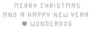

# wundernut-five
> Decoding Wundernut no. 5

Here's my take on [the fifth Wundernut](https://github.com/wunderdogsw/wunderpahkina-vol5#secret-message). It's not the most elegant solution, but it's the best I could manage without using a canvas library :)

This is what I got:



The code used to generate this solution can be found in `index.js`.

## Installation
Clone and install dependencies to run the code on your system.

```sh
$ git clone https://github.com/semibran/wundernut-five.git
...
$ cd wundernut-five
$ npm install
```

After installation, `npm start` should run automatically and run `index.js` in your browser.
